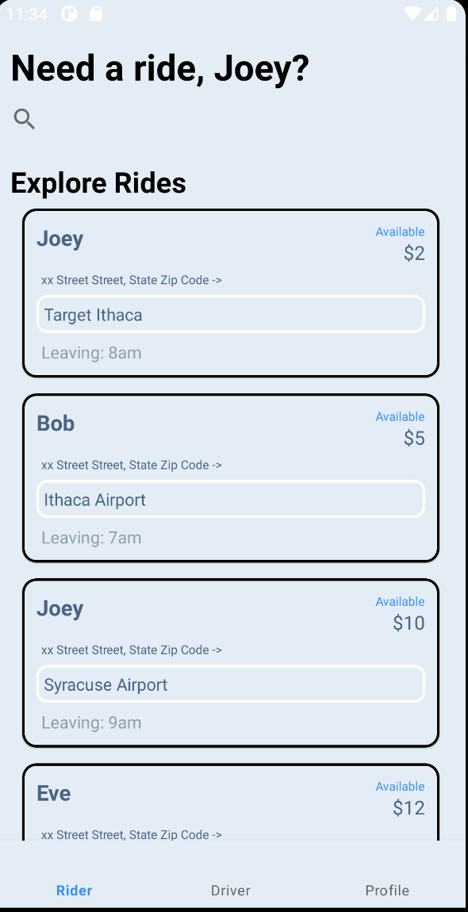
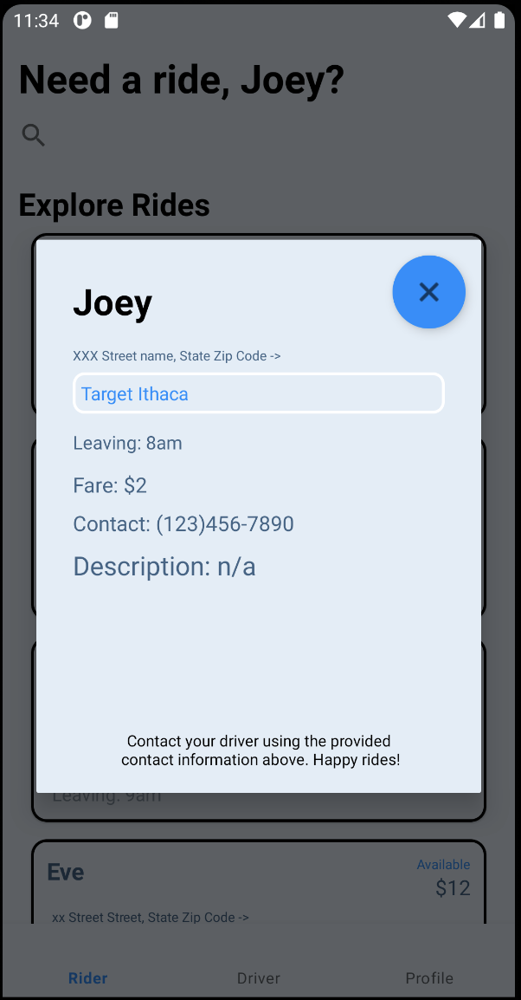
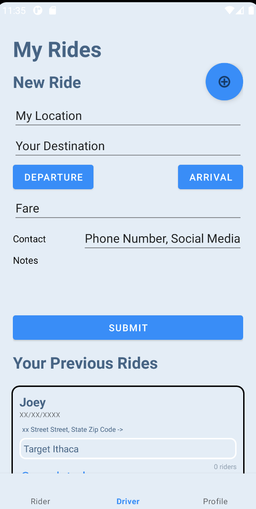

# rideshare-android

# Pooler

CarPOOL with us!

## Backend Github

Backend Github: <https://github.com/joeymorquecho/rideshare-backend>

## Screenshots

Rider Screen displaying all rides.

Detail Popup of a ride after clicking on one in the Rider Screen.

Driver Screen with form for posting a ride and a list of previous rides driven.

## Implementation

We implemented 3 main tabs: Rider, Driver, and Profile. In Rider, the user can view all available rides (retrieved through networking requests) in a recycler view as well as filter them through the search bar by ride destination. Clicking on a ride in the recycler view displays a detail view dialog fragment for that ride. This offers more details about the ride and the user can exit by clicking the exit button or anywhere on the gray area outside of the detail view. In Driver, we have a form (not working as it is not connected to any POST request) which can be toggled using the “+” button next to “New Ride”. Below this is a recycler view of the user’s past rides as a driver, these rides are retrieved using a networking request. Profile is blank as we ran out of time for implementation for what we specifically wanted in this tab.

## Meets requirements

Android:

- has recycler view with custom adapter on rider and driver screen
- Integration with backend for rides
- use of Moshi and OkHTTP
- 3 functional screens: Rider, Driver, Detail View

Backend:

- All routes and tables as specified in API spec and backend Github
- Authentication implemented
